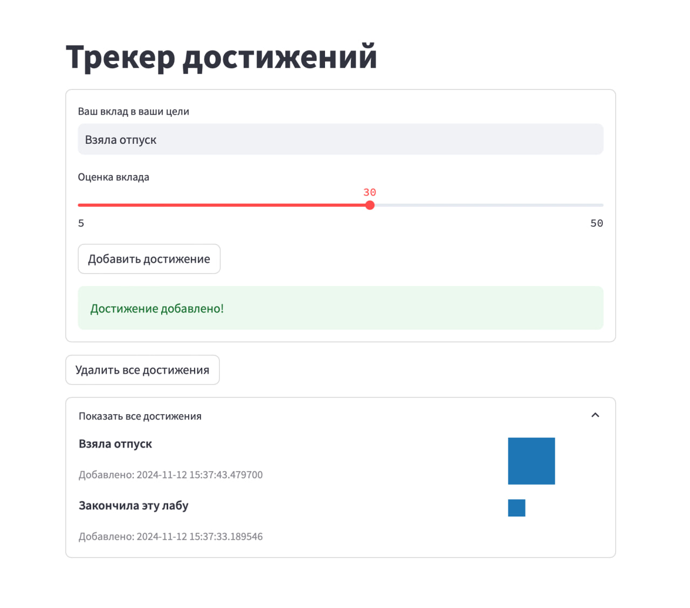

## Описание сервиса

Простенький сервис для отслеживания достижений. Пользователь может добавить достижение, указав его название и вес. Достижения отображаются в истории пропорционально их весу.

Можно заполнить data/quotes_sample.txt на свой вкус – добавить свои цитаты.

docker-compose.yml включает три сервиса:

- postgres: база данных; хранит достижения
- init-db: инициализация базы данных.
- web: Streamlit приложение


## Запуск сервиса
```bash
docker compose up
```

## Остановка и полное удаление сервиса (вместе с данными)
```bash
docker compose down --volumes
```